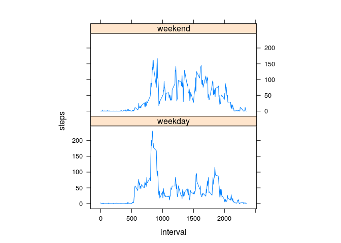

# Reproducible Research: Peer Assessment 1


## Loading and preprocessing the data


```r
activity <- read.csv("activity.csv")
```


## What is mean total number of steps taken per day?


```r
#Total number of steps per day (61 observations)
step_day <- aggregate(steps~date, data = activity, sum, na.rm = TRUE)

# Histogram of steps per day
hist(step_day$step, main= "Total Number of Steps per Day",
                                xlab = "Number of Steps", ylab = "Frequency",
                                col = "blue")
```

 

```r
# Calculate mean
mean(step_day$step)
```

```
## [1] 10766.19
```

```r
# calculate median
median(step_day$step)
```

```
## [1] 10765
```

## What is the average daily activity pattern?

```r
# Average number of steps per interval
step_int <- aggregate(steps~interval, data = activity, mean, na.rm = TRUE)

# Plot timeseries steps ~ interval
plot(steps~interval, data = step_int, type = "l")
```

 

```r
# interval with maximum number of steps

step_int[which.max(step_int$steps),]$interval
```

```
## [1] 835
```

## Imputing missing values


```r
# Calculate the total number of missing values in the dataset
sum(is.na(activity$steps))
```

```
## [1] 2304
```

```r
#  filling in all of the missing values with mean for that 5-minute interval
# Create a new dataset (new_activity)

new_activity <- activity
for (i in 1:nrow(new_activity)){
        if(is.na(new_activity[i, ]$steps)){
                interval <- new_activity[i, ]$interval
                new_activity[i, ]$steps <- step_int[which(step_int$interval==interval),]$steps
        }
}

# histogram of the total number of steps taken each day

new_step_day <- aggregate(steps~date, data = new_activity, sum)

# Histogram of steps per day
hist(new_step_day$step, main= "Total Number of Steps per Day",
                                xlab = "Number of Steps", ylab = "Frequency",
                                col = "red")
```

 

```r
# Calculate mean
mean(new_step_day$step)
```

```
## [1] 10766.19
```

```r
# calculate median
median(new_step_day$step)
```

```
## [1] 10766.19
```
* After replacing missing values with mean of the steps, mean and median are the same. median shifted toward mean this indicates that majority of missing values were above median in activity data set.

## Are there differences in activity patterns between weekdays and weekends?

```r
# add new variable day and change it to factor
new_activity$day <- weekdays(as.Date(new_activity$date, "%Y-%m-%d"))
for (i in 1:nrow(new_activity)){
        if(new_activity$day[i]=="Sunday" || new_activity$day[i]=="Saturday"){
              new_activity$day[i] = "weekend"
              
        } else new_activity$day[i] = "weekday"
}

# aggregate data based on interval and day
step_int2 <- aggregate(steps~ interval + day, data = new_activity, mean)

# Using XYplot in lattice package for the plot
library(lattice)
xyplot(steps~ interval | factor(day), data = step_int2,aspect = 1/2, type = 'l')
```

 
